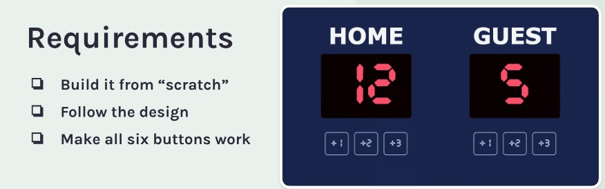

# JS-Basketball-Scorecard
## Table of Contents (Optional)

- [Installation](#installation)
- [Usage](#usage)
- [Credits](#credits)
- [License](#license)

## Installation

To install the Basketball Scoreboard App:
1. Clone the repository from GitHub:
git clone https://github.com/grayd500/JS-Basketball-Scorecard.git
2. Navigate to the cloned directory.
3. Open the `index.html` file in a web browser to view the app.

## Usage

To use the Basketball Scoreboard App:
1. Click the `+1`, `+2`, or `+3` buttons under each team's name to add points to their score.
2. To reset the scores for both teams, click the 'clear-all' button.

## Credits

- Figma Template: [Basketball Scoreboard](https://www.figma.com/file/72OGPnCzwoDqJx2m3qCKaL/Basketball-Scoreboard-(Copy))
- Font: [Cursed Timer ULiL](https://www.cdnfonts.com/cursed-timer-ulil.font)
- Course: [Scrimba - Frontend Developer Career Path](https://scrimba.com/learn/frontend/)

Special thanks to Scrimba for the course and learning materials that contributed to this project.

## License

This project is licensed under the MIT License - see the [LICENSE](LICENSE.md) file for details.

## Features

- Dynamic score updating for two teams (Home and Guest).
- Interactive buttons for score increments.
- 'Clear-all' functionality to reset the scores.
- Custom font integration for a unique user interface.

## How to Contribute

Contributions to the Basketball Scoreboard App are welcome! Please adhere to the [Contributor Covenant](https://www.contributor-covenant.org/) for community guidelines.
